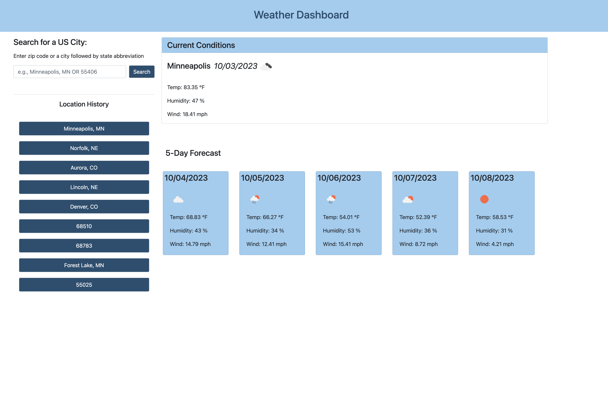

# Weather Dashboard

## Description

This application serves as a weather dashboard to provide a user the current weather conditions for a chosen US city, as well as a five day forecast for the upcoming days.

## Usage

A location can be entered into the search bar in the form of a city and state or by entering a zip code. The user will then be given the current temperature, humidity, and wind speed, along with an icon indicating the conditions. The upcoming five day forecast is presented below the current conditions and provides the same metrics for those given days.

If there is an error in the search, the error code and status message will be displayed to the user.

## Screenshot

## Link

[https://jaredbartos.github.io/weather-dashboard](https://jaredbartos.github.io/weather-dashboard)